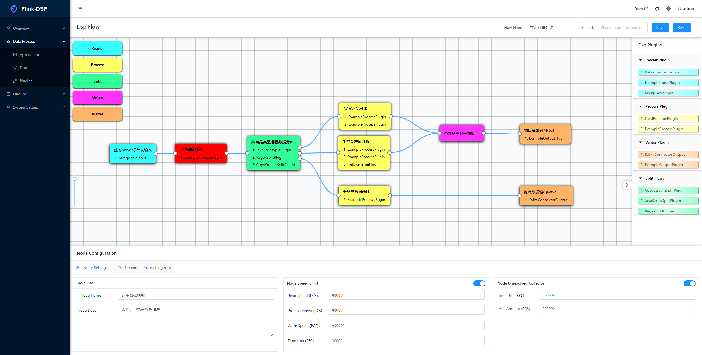
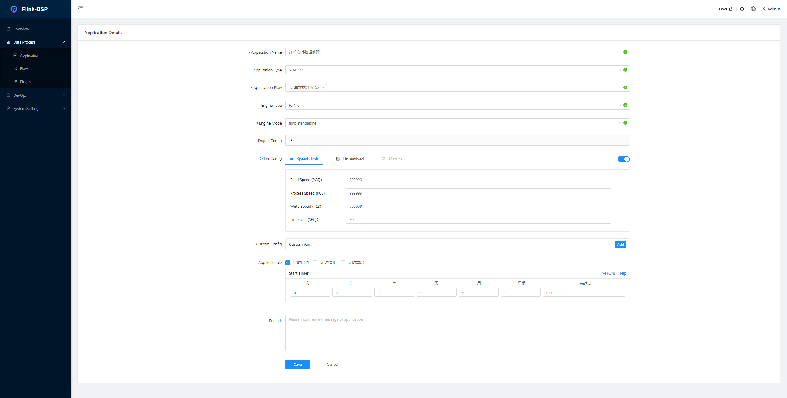
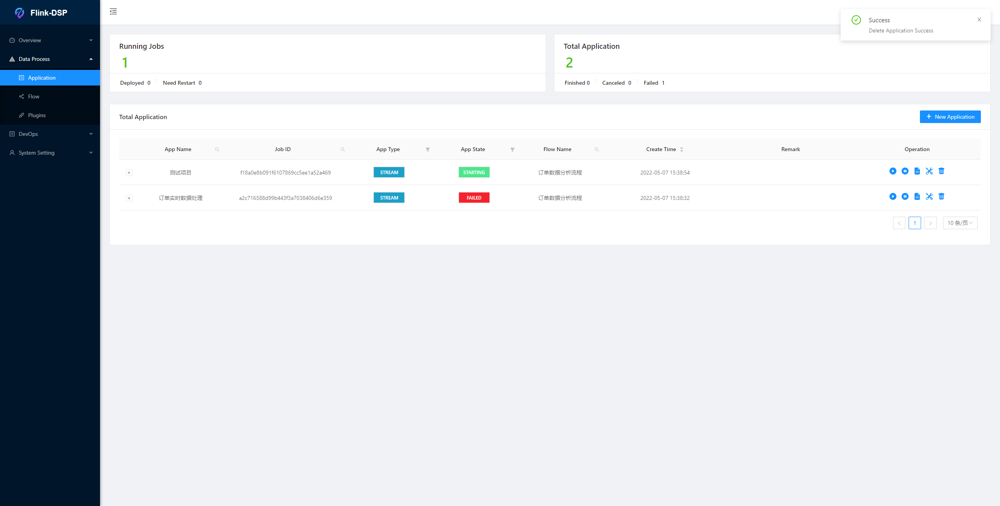
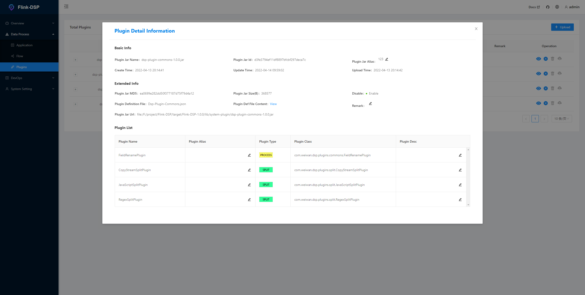

# Flink-DSP

> ⚡A Flink-based Stream Processing Business Platform

<p align="center" >

</p>
<p align="center">
  <a href="https://www.apache.org/licenses/LICENSE-2.0.html"></a>
  
  
  
</p>


#### English | [中文](README_zhCN.md)
## 🍺Table of contents

- [Introduction](#Introduction)
- [Features](#Features)
- [QuickStart](#QuickStart)
  - [Installation](Installation)
  - [Running](Running)
- [Modules](#Modules)
- [Documents](#Documents)
- [Contribution](#Contribution)
- [Thanks](#Thanks)
- [License](#License)


## 🌌Introduction

&ensp;Flink-DSP can help you process business data streams by drag-and-drop action. By developing reusable plugins and applying them in your process, the cost of data service development can be greatly reduced.

&ensp;Relying on the powerful features provided by Flink, such as massively parallel processing and high availability, business applications processed through Flink-DSP contain these features natively.

>  **💥❗ Attention! This project is still in developing stage. If you are interested in it, join us to perfect it together❗❗❗**

## ⚡Features

- DAG-based Business Process Design

- Flink Deployment Modes Support

- Plugin Upload & Management

- Built-in General Plugins and Connectors

- Flink-based Data Streams Split and Merge

- Quartz-based Simple Task Schedule

- Friendly Plugin Develop Interface

- Friendly Engine Develop Interface 

- Various Illegal Data Collect Plans Support

- Customizable Flink Metrics Collect and Report System

- Simple and Convenient Dashboard

- Standard Data Structure (JSON / Customized)

- Outstanding Documents Support

- Other

  

  

  

  

## 🚀QuickStart

#### Installation

- Prepare💢
  - **JDK:** version > 1.8.291
  - **Maven:** version > 3.6.1
  - **Flink:** version > 1.14.0
  - **MySql:** version > 5.7

- Download

  ```shell
  git clone https://github.com/WeiWan5675/Flink-DSP.git
  ```

- Compile

  ```shell
  mvn clean install -DskipTests
  ```

  When package is finished, you can find the package `Flink-DSP-${version}.tar.gz` in the directory `${base.dir}/target`.

- install

  Use the command below to uncompress the artifact package to the install directory.

  ```shell
  tar -zxvf Flink-DSP-${version}.tar.gz
  ```

#### Running

- Commands
  - Start

    ```shell
    ${base.dir}/bin/dsp.sh console start
    ```

  - Stop

    ```shell
    ${base.dir}/bin/dsp.sh console stop
    ```

  - Restart

    ```shell
    ${base.dir}/bin/dsp.sh console restart
    ```

  - Status

    ```shell
    ${base.dir}/bin/dsp.sh console status
    ```

- View

  Use browser to open the url below, and use default username and password `admin/123456` to login.

  ```shell
  http://127.0.0.1:9876/
  ```

## 🏠Modules

- **dsp-core**

   Core module, including plugin framework and runtime framework

- **dsp-runtime**

  Entrypoint of the Flink-DSP program, with functions of resolving job DAG, engine connecting, and plugin loading

- **dsp-console**

  Console module, a background management service developed through [SpringBoot](https://spring.io/projects/spring-boot) and [MyBatisPlus](https://baomidou.com/)

- **dsp-console-web**

  Front-end project of console module, developed through [vue](https://vuejs.org/), [antdv ](https://antdv.com/docs/vue/introduce-cn/), [Drawflow](https://github.com/jerosoler/Drawflow), etc.

- **dsp-extends**

  Extending module of DSP, including general plugins, customized MetricsReport, schedule user interface, etc.

> About more details of technology and framework of Flink-DSP, please see our [online documents](http://127.0.0.1/dsp/docs) 🥂

## 📖Documents

Click [online documents](http://127.0.0.1:8000/dsp/docs) to get more information.

Or click the right top button on console web after startup to see documents.

## 👋Contribution

You could help Flink-DSP development in many ways。

* [Sending feedback and suggestion](https://github.com/WeiWan5675/Flink-DSP/issues)。

* Spread and promote this project to your friends. Popularity is a strong power to drive developers。

* If you're a software developer and want to get involved. [online documents](http://127.0.0.1/dsp/docs)。

* Contact with me and join our wechat group. Here is my QR code. 🎈

   

## 💖Thanks

- My Partners

<p>
    <a href="https://github.com/WeiWan5675" alt="WeiWan5675"></a>
    <a href="https://github.com/Kris-hanqi" alt="Kris-hanqi"></a>
    <a href="https://github.com/mia369" alt="mia369"></a>
    <a href="https://github.com/a690223483" alt="a690223483"></a>
</p>

&ensp;Thank them. Without their contributions and supports, this project will never reach this stage. Also thank everyone who has helped me.

- [Apache Flink](https://flink.apache.org/)

 
&ensp;Thank Flink who provides the powerful tool, so that we can do whatever we want.

## License

[Apache License 2.0](./LICENSE)