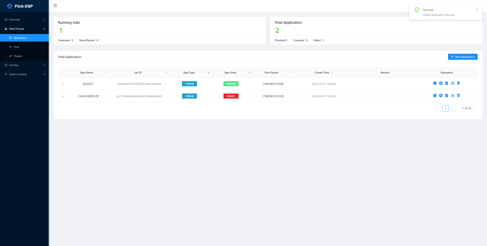
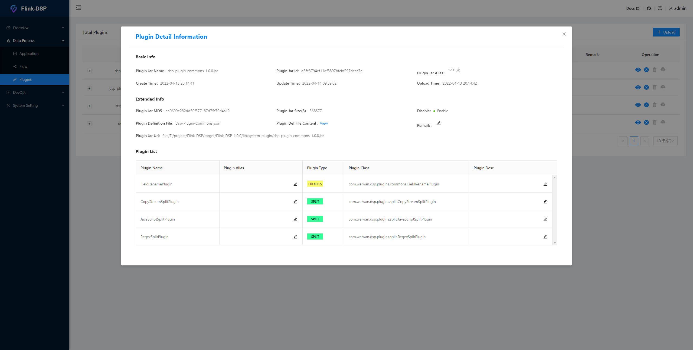

# Flink-DSP

> ⚡一个基于Flink的流处理业务平台。

<p align="center" >

</p>
<p align="center">
  <a href="https://www.apache.org/licenses/LICENSE-2.0.html"></a>
  
  
  
</p>


#### [English](README.md) | 中文
## 🍺Table of contents

- [Introduction](#Introduction)
- [Features](#Features)
- [QuickStart](#QuickStart)
  - [Installation](Installation)
  - [Running](Running)
- [Modules](#Modules)
- [Documents](#Documents)
- [Contribution](#Contribution)
- [Thanks](#Thanks)
- [License](#License)


## 🌌Introduction

&ensp;Flink-DSP可以帮助您以拖拽的形式，对业务数据流的处理。通过开发可复用的插件，在您的流程中应用自定义的插件，能够极大的降低数据业务开发的成本。

&ensp;依托Flink提供如大规模并行处理，高可用等强大特性，通过Flink-DSP进行处理的业务应用源生的包含了这些特性。

>  **💥❗ 请注意! 此项目还处于早期开发阶段, 如果您有兴趣, 可以加入我们一起完成它❗❗❗**

## ⚡Features

- 基于DAG的业务流程设计

- Flink各种部署模式支持

- 插件上传及管理

- 开箱即用的通用插件及连接器插件

- 基于Flink的数据流拆分合并

- 基于Quartz的简单任务调度

- 面向开发者友好的插件接口

- 面向开发者友好的引擎能力接口

- 多种异常数据收集方案支持

- 用户可自定义的Flink Metrics 采集及上报系统

- 简单方便的运行监控面板

- 标准的数据结构（JSON或自定义）

- 完整的文档支持

- 其它

  

  

  

  

## 🚀QuickStart

#### Installation

- 要求💢
  - **JDK:** version > 1.8.291
  - **Maven:** version > 3.6.1
  - **Flink:** version > 1.14.0
  - **MySql:** version > 5.7

- 下载

  ```shell
  git clone https://github.com/WeiWan5675/Flink-DSP.git
  ```

- 编译

  ```shell
  mvn clean install -DskipTests
  ```

  打包完成后在`${base.dir}/target`目录中，可以找到`Flink-DSP-${version}.tar.gz`包

- 安装

  使用下方命令将项目制品包解压到安装目录，即可完成安装

  ```shell
  tar -zxvf Flink-DSP-${version}.tar.gz
  ```

#### Running

- 命令
  - 启动

    ```shell
    ${base.dir}/bin/dsp.sh console start
    ```

  - 停止

    ```shell
    ${base.dir}/bin/dsp.sh console stop
    ```

  - 重启

    ```shell
    ${base.dir}/bin/dsp.sh console restart
    ```

  - 查看状态

    ```shell
    ${base.dir}/bin/dsp.sh console status
    ```

- 查看

  浏览器访问下方链接，使用默认用户及密码`admin/123456`登录即可

  ```shell
  http://127.0.0.1:9876/
  ```

## 🏠Modules

- **dsp-core**

  核心模块，包含了插件框架以及运行时框架

- **dsp-runtime**

  作为Flink-DSP程序的入口，主要负责任务DAG的解析、计算引擎关联、插件的加载等。

- **dsp-console**

  控制台模块，采用[SpringBoot](https://spring.io/projects/spring-boot) + [MyBatisPlus](https://baomidou.com/)开发的后台管理服务

- **dsp-console-web**

  控制台模块的前端项目，采用[vue](https://vuejs.org/) + [antdv ](https://antdv.com/docs/vue/introduce-cn/)+ [Drawflow](https://github.com/jerosoler/Drawflow)等

- **dsp-extends**

  dsp的扩展模块，包含通用插件、自定义MetricsReport、Schedule用户接口等

> 关于Flink-DSP更多技术及架构细节，可以查看我们的[在线文档](http://127.0.0.1/dsp/docs) 🥂

## 📖Documents

点击[在线文档](http://127.0.0.1:8000/dsp/docs)查看更多内容。

或在项目启动后右上角文档按钮进入离线文档。

## 👋Contribution

You could help Flink-DSP development in many ways。

* [Sending feedback and suggestion](https://github.com/WeiWan5675/Flink-DSP/issues)。

* Spread and promote this extension to your friend. Popularity is a strong power to drive developers。

* If you're a software developer and want to get involved. [在线文档](http://127.0.0.1/dsp/docs)。

* 和我取得联系，然后加入社区微信群, 下面是我的二维码。

   

## 💖Thanks

- 我的伙伴们

<p>
    <a href="https://github.com/WeiWan5675" alt="WeiWan5675"></a>
    <a href="https://github.com/Kris-hanqi" alt="Kris-hanqi"></a>
    <a href="https://github.com/mia369" alt="mia369"></a>
    <a href="https://github.com/a690223483" alt="mia369"></a>
</p>

&ensp;感谢他们，没有他们的贡献和支持就没有这个项目, 也感谢在这个过程中给我帮助的所有人

- [Apache Flink](https://flink.apache.org/)

 
&ensp;感谢Flink为我们提供了强大的能力和工具，让我们有这样的平台和机会来开发自己的程序

## License

[Apache License 2.0](./LICENSE)